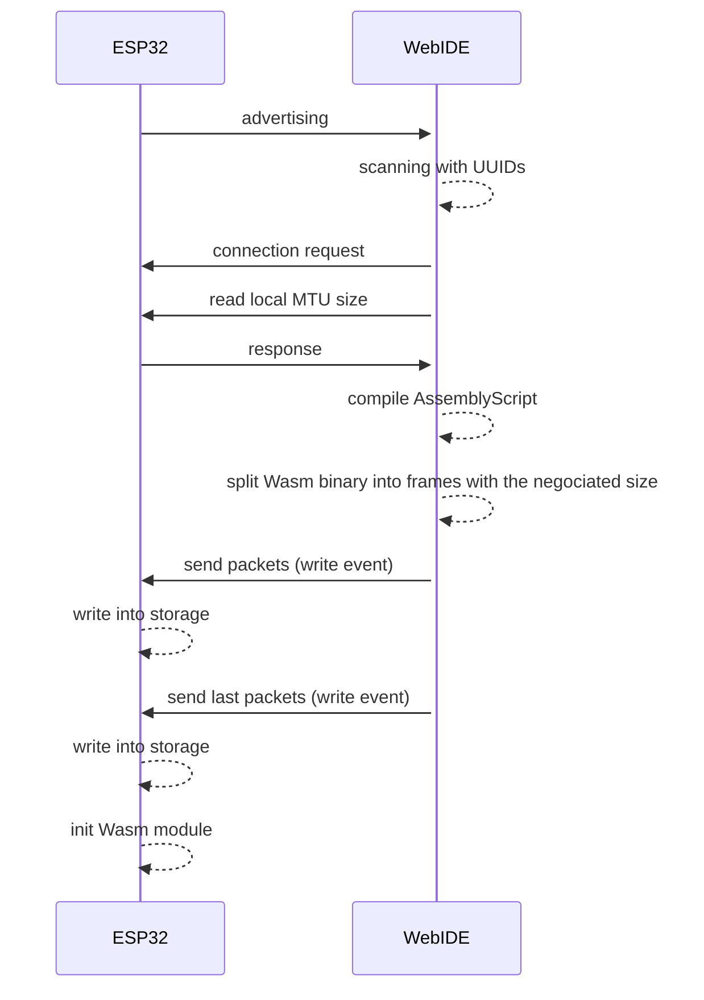

# Web UI for monitoring ESPs Mesh network and update WASM
An experimental Web UI for monitoring ESP-WIFI-MESH data stream network with WebAssembly (WASM). This UI communicates an ESP MCU via BLE provides the following functionarities:
- AssemblyScript IDE, compiling and uploading WASM
- Datastream modification based on the graph
  - data stream (add/remove links)
  - moving WASM module
  - delete WASM module

## Instruction
Due to the implementation, there are two GATT services for uploading WASM and graph functions. Therefore, each service should be scanned and connected separately.

### How to update data stream graph
1. Scan a monitor node with the button "Get mesh graph service"
2. Click the button "Update mesh network graph"

### How to upload WASM
1. Update data stream graph
3. Click the button "Get WASM upload serive"
4. Choose a target node in the graph. It checks whether the selected node has WASM runtime environment.
5. You can write your AssemblyScript code in the text field
6. (Input the number of function parameters)
7. Click "Compile and load"

## Overview of the communication with the MESH-network

