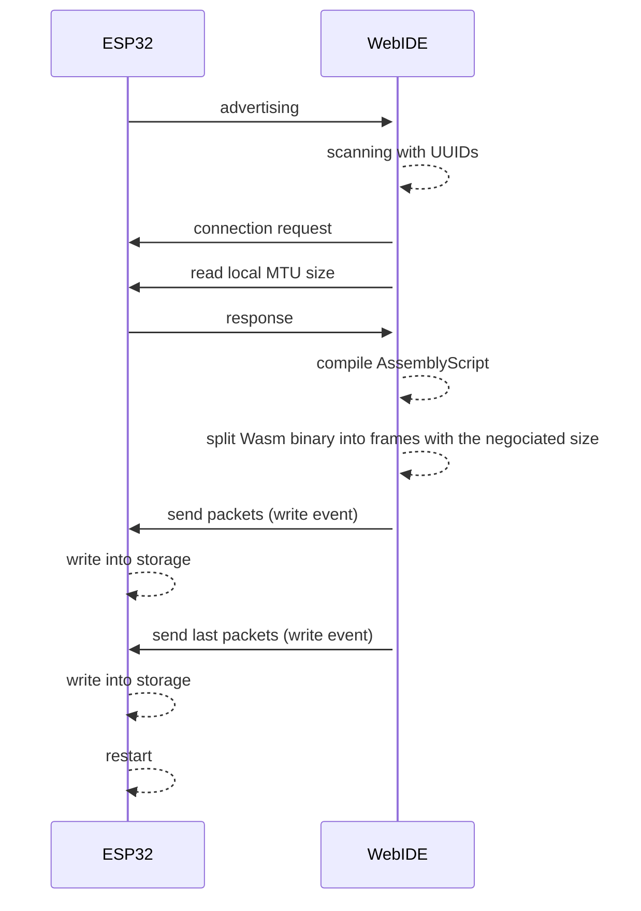

# Wasm-ble-web-ide

```mermaid
sequenceDiagram
    ESP32->>+WebIDE: advertising
    WebIDE-->>WebIDE: scanning with UUIDs
    WebIDE->>ESP32: connection request
    WebIDE->>ESP32: read local MTU size 
    ESP32->>WebIDE: response
    WebIDE-->>WebIDE: compile AssemblyScript
    WebIDE-->>WebIDE: split Wasm binary into frames with the negociated size
    WebIDE->>ESP32: send packets (write event)
    ESP32-->>ESP32: write into storage
    WebIDE->>ESP32: send last packets (write event)
    ESP32-->>ESP32: write into storage
    ESP32-->>ESP32: restart
```
